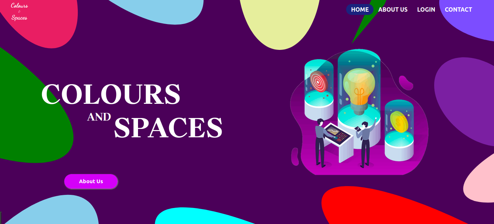
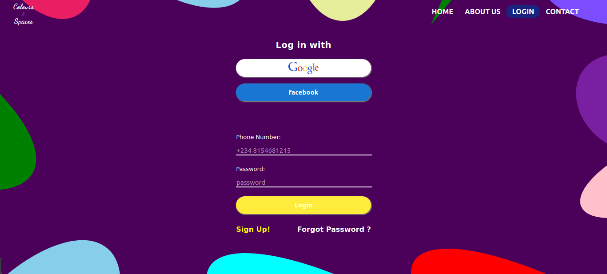
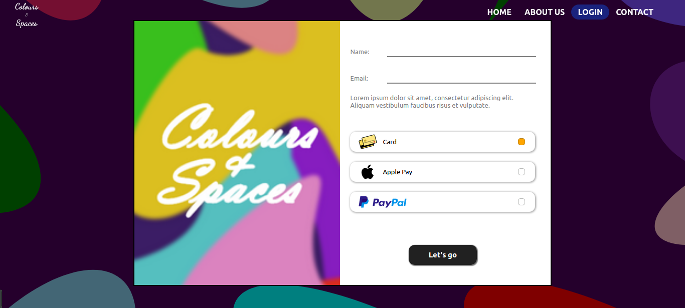

## Colours and Spaces

A simple react template built with styled components and material UI

#### `To use this template`

Run the following in your terminal: 
1. git clone https://github.com/sammyyOzz/colours-and-spaces
2. npm install

Open [http://localhost:3000](http://localhost:3000) to view it in the browser.

